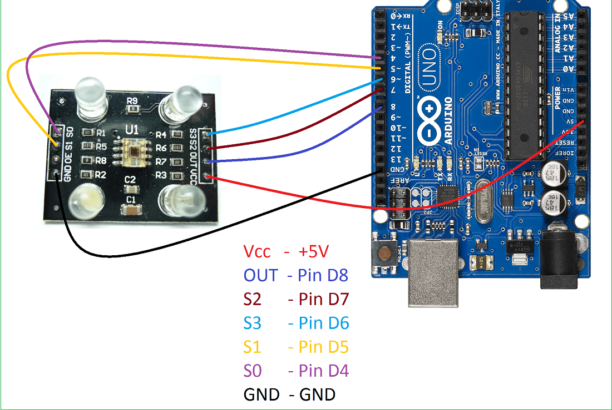

# Arduino RGB Color Detector  

This project uses the **TCS230 color sensor** with an Arduino and a **16x2 I2C LCD** to detect and display colors.  
The system measures RGB values and identifies colors such as Red, Green, Blue, Yellow, Pink, Orange, Purple, and White.  
Detected colors are shown on the LCD and printed to the Serial Monitor.  

---

## 🔧 Components Required
- Arduino Uno (or compatible board)  
- TCS230/TCS3200 Color Sensor  
- 16x2 I2C LCD Display  
- Jumper Wires  
- Breadboard  

---

## ⚡ Pin Connections

### TCS230 → Arduino
- **S0 → 4**  
- **S1 → 5**  
- **S2 → 7**  
- **S3 → 6**  
- **OUT → 8**  
- **VCC → 5V**  
- **GND → GND**  

### LCD (I2C) → Arduino
- **SDA → SDA**  
- **SCL → SCL**  
- **VCC → 5V**  
- **GND → GND**  

---

## ⚡ Features
- Reads RGB values from TCS230 sensor  
- Displays live values on Serial Monitor  
- Detects and identifies multiple colors  
- Shows detected color name on LCD  

---
## ⚡ Circuit Diagram
  

---
## 🎥 Demo Video
Watch the working demo on my YouTube channel:  
👉 [Ecempire7](https://www.youtube.com/@Ecempire7)  

---

## 🚀 Steps to Run
1. Connect the TCS230 sensor and I2C LCD to Arduino as per wiring above.  
2. Upload the Arduino code.  
3. Open the Serial Monitor at **9600 baud**.  
4. Place different colored objects in front of the sensor.  
5. The LCD and Serial Monitor will display the detected color.  
